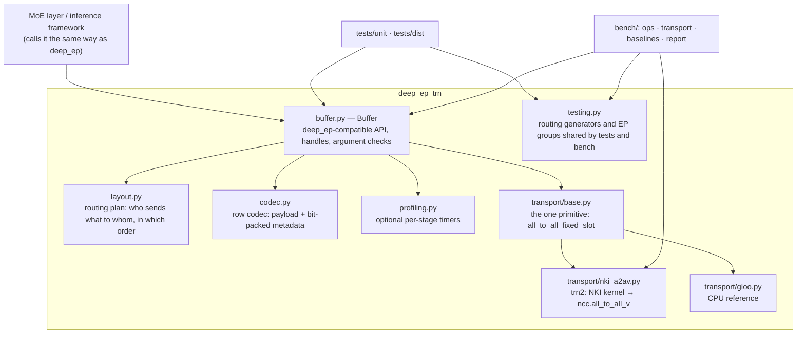

# Architecture

## Layers



| Module | Responsible for | Not responsible for |
|---|---|---|
| `buffer.py` | Public API; splits every op into plan → encode → exchange → decode; builds handles | Communication details, row format details |
| `layout.py` | Pure-torch routing math: `get_dispatch_layout`, `send_plan`, `pair_plan`, `slot_index` | Devices and communication |
| `codec.py` | A row is, in order: payload (H columns), top-k weights (fp32), expert ids (int32), source token index, alignment padding; bit-exact encode/decode | Routing logic |
| `transport/*` | One thing only: exchange rows packed by destination rank into a fixed slot per source rank | Routing, row format |
| `profiling.py` | Off by default; when on, times each stage with a sync at its boundaries | — |
| `testing.py` | Synthetic routing, EP groups, deterministic expert emulation | Not part of the stable API |

## Core abstraction: a single communication primitive

```
all_to_all_fixed_slot(send[cap, W], counts[R], slot) -> recv[R * slot, W], recv_counts[R]
```

- **Input**: the sender packs rows contiguously by destination rank.
- **Output**: the receiver finds the rows from source rank `s` at `[s * slot, s * slot + recv_counts[s])`.

Why this primitive:

1. **It is the only shape trn2 supports inside a node.**
   - Intra-node `all_to_all_v` only supports `has_rdispls=False`, i.e. fixed slots.
   - The driver also requires `dst = EP × src`, so the NKI backend's `slot` equals the whole send capacity.
2. **All four ops reduce to it**: normal dispatch / combine and LL dispatch / combine. They differ only in which rows are sent, in which order, and with what capacity; `Buffer` and `layout.py` decide all of that.
3. **A new backend only has to implement this one contract.** Examples: inter-node groups using `has_rdispls=True` for compact receives, or a future version that packs on the device. The gloo backend implements the same contract to verify semantics bit-for-bit on the CPU.

## Data flow

### Normal mode

```mermaid
sequenceDiagram
    participant S as Source rank
    participant D as Destination rank (owns the experts)
    Note over S: plan: is_token_in_rank → send_plan<br/>(ordered by destination rank, then token)
    Note over S: pack: one row per (token, destination rank),<br/>with top-k weights / expert ids / token index at the end
    S->>D: a2a no. 1 (capacity M·min(K,R))
    Note over D: unpack: compact the slots → recv_x<br/>(ordered by source rank, then source token)<br/>global ids → local ids; non-local set to -1 with weight 0
    Note over D: user experts: each row reduces this rank's experts
    D->>S: a2a no. 2 (capacity R·M, counts = rows originally received)
    Note over S: index_add by handle.send_token_idx<br/>→ combined[T, H]
```

### Low-latency mode

- **dispatch**: same wire format as normal mode, one row per (token, rank). The receiver then expands rows per local expert into `[EL, R·M, H]`.
  - `pair_expert` / `pair_pos` record which expert, and which position in it, each (row, k) lands in.
  - Within an expert, rows are ordered by (source rank, source token); `layout_range` gives each source's range.
- **combine**: one row per (token, expert) goes back (capacity `R·M·min(K,EL)`). The source rebuilds (t, k) with `pair_plan`, multiplies by the top-k weights and sums, matching deep_ep LL semantics.

### Capacities (these set buffer sizes and compiled shapes)

| Exchange | Send capacity (rows) | NKI receive buffer (rows) |
|---|---|---|
| normal / LL dispatch | `M · min(K, R)` | `R · M · min(K, R)` |
| normal combine | `R · M` | `R² · M` |
| LL combine | `R · M · min(K, EL)` | `R² · M · min(K, EL)` |

`M` = max tokens per rank (static), `R` = EP size, `K` = top-k, `EL` = experts per rank.

## What the handles hold

| Handle | Fields | Used for |
|---|---|---|
| `DispatchHandle` | `send_token_idx`, `send_counts` | Reducing per token after combine |
| | `recv_counts`, `recv_src_idx` | Combine's send counts; debugging |
| | `is_token_in_rank`, `topk` | Cached dispatch |
| `LowLatencyHandle` | `pair_expert`, `pair_pos`, `pairs_per_src` | Combine gathering rows from `[EL, R·M, H]` and sending them back |
| | `src_info`, `layout_range` | Counterparts of the deep_ep LL handle |

## Extension points

- **New transport backend**: subclass `Transport` and implement `slot_rows` and `all_to_all_fixed_slot`. Implement `resident_call` too if it should run in the benchmarks.
- **Stage 2 (data stays on device)**: the boundaries marked with `timer.stage(...)` in `Buffer` (plan / pack / unpack) are the parts to move into NKI kernels.
  - The transport will then take and return device tensors directly.
  - The end state is one NEFF per op.
- **Stage 3 (fused experts)**: put dispatch → expert → combine in one NEFF to remove the fixed cost of two launches.

## Trade-offs and known limitations

- **One replica-group layout per process**, because NKI resolves module globals.
- **Capacity is static** (`num_max_tokens_per_rank`) and must match on every rank. Exceeding it raises an error instead of truncating silently.
- **v0 packs and unpacks on the host.** That got the semantics and tests solid first, and the benchmarks break this overhead out separately (see [benchmark.md](benchmark.md)).
- **LL combine returns one row per (token, expert)** to keep deep_ep semantics. A receiver-side-reduce variant is on the roadmap.
