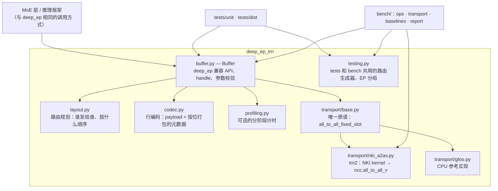
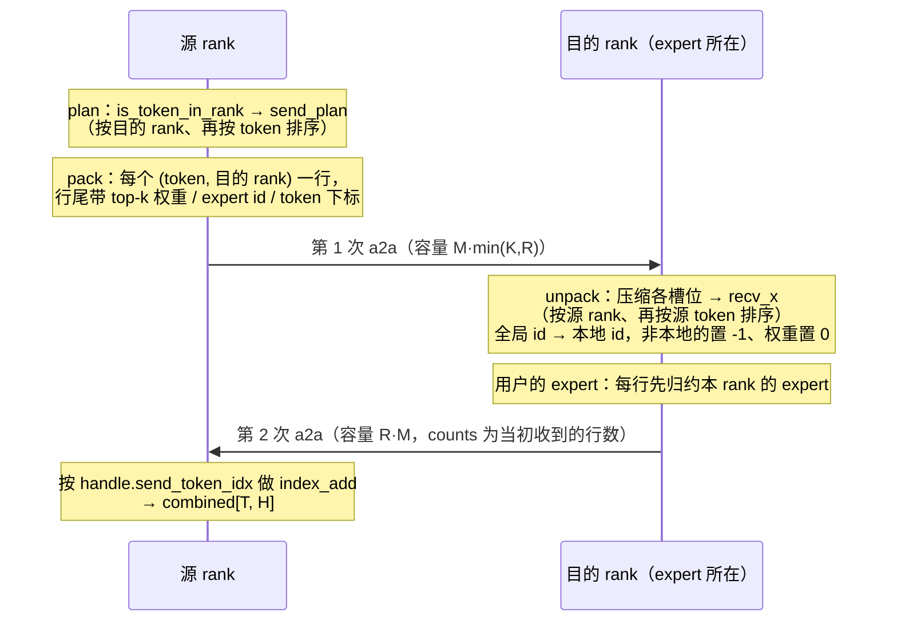

# 架构

## 分层



| 模块 | 职责 | 不负责 |
|---|---|---|
| `buffer.py` | 对外 API；把每个 op 拆成"规划 → 编码 → 交换 → 解码"；构造 handle | 通信细节、行格式细节 |
| `layout.py` | 纯 torch 的路由计算：`get_dispatch_layout`、`send_plan`、`pair_plan`、`slot_index` | 设备与通信 |
| `codec.py` | 一行依次是：payload（H 列）、top-k 权重（fp32）、expert id（int32）、源 token 下标、对齐填充；按位精确编解码 | 路由逻辑 |
| `transport/*` | 只做一件事：按目的 rank 打包好的行，交换到每个源 rank 的固定槽位 | 路由、行格式 |
| `profiling.py` | 默认关闭；开启后在阶段边界同步计时 | — |
| `testing.py` | 合成路由、EP 分组、确定性的 expert 模拟 | 不属于稳定 API |

## 核心抽象：只有一个通信原语

```
all_to_all_fixed_slot(send[cap, W], counts[R], slot) -> recv[R * slot, W], recv_counts[R]
```

- **输入**：发送端把行按目的 rank 连续打包。
- **输出**：接收端在 `[s * slot, s * slot + recv_counts[s])` 拿到来自源 rank `s` 的行。

选这个原语有三个原因：

1. **它就是 trn2 单机唯一可用的形态。**
   - 单机组内的 `all_to_all_v` 只支持 `has_rdispls=False`，也就是固定槽位。
   - 驱动还要求 `dst = EP × src`，所以 NKI 后端的 `slot` 等于整个发送容量。
2. **四个 op 都能归约到它**：normal dispatch / combine、LL dispatch / combine。区别只在于"发哪些行、按什么顺序、用什么容量"，这些都由 `Buffer` 和 `layout.py` 决定。
3. **换后端只需要实现这一个契约。** 比如跨机组可以用 `has_rdispls=True` 做紧凑接收，或者以后有 device 侧打包的版本。gloo 后端用同一契约，在 CPU 上逐位验证语义。

## 数据流

### normal 模式



### low-latency 模式

- **dispatch**：线上格式和 normal 相同，每个 (token, rank) 只发一行。接收端再按本地 expert 展开成 `[EL, R·M, H]`。
  - `pair_expert` / `pair_pos` 记录每个 (行, k) 落在哪个 expert 的哪个位置。
  - 同一 expert 内按 (源 rank, 源 token) 排序，`layout_range` 给出每个源的区间。
- **combine**：每个 (token, expert) 回传一行（容量 `R·M·min(K,EL)`）。源端用 `pair_plan` 还原 (t, k)，乘 top-k 权重后求和，语义与 deep_ep LL 相同。

### 容量（决定 buffer 大小和编译出的 shape）

| 交换 | 发送容量（行） | NKI 接收 buffer（行） |
|---|---|---|
| normal / LL dispatch | `M · min(K, R)` | `R · M · min(K, R)` |
| normal combine | `R · M` | `R² · M` |
| LL combine | `R · M · min(K, EL)` | `R² · M · min(K, EL)` |

`M` = 每 rank 的最大 token 数（静态），`R` = EP 大小，`K` = top-k，`EL` = 每 rank 的 expert 数。

## handle 里存什么

| handle | 字段 | 用途 |
|---|---|---|
| `DispatchHandle` | `send_token_idx`、`send_counts` | combine 回来后按 token 归约 |
| | `recv_counts`、`recv_src_idx` | combine 的发送 counts；调试 |
| | `is_token_in_rank`、`topk` | cached dispatch |
| `LowLatencyHandle` | `pair_expert`、`pair_pos`、`pairs_per_src` | combine 从 `[EL, R·M, H]` 取行并回传 |
| | `src_info`、`layout_range` | 与 deep_ep LL handle 对应的信息 |

## 扩展点

- **新传输后端**：继承 `Transport`，实现 `slot_rows` 和 `all_to_all_fixed_slot`。如果要进 benchmark，再实现 `resident_call`。
- **Stage 2（数据常驻设备）**：`Buffer` 里用 `timer.stage(...)` 划出的边界（plan / pack / unpack）就是要搬进 NKI kernel 的部分。
  - transport 届时改为直接接收和返回设备 tensor。
  - 最终每个 op 编译成一个 NEFF。
- **Stage 3（融合 expert）**：dispatch → expert → combine 进同一个 NEFF，消掉两次 launch 的固定开销。

## 设计取舍与已知限制

- **每个进程只能有一套 replica-group 布局。** 原因是 NKI 解析的是模块全局变量。
- **容量是静态的**（`num_max_tokens_per_rank`），所有 rank 必须一致；超出会报错，不会静默截断。
- **v0 的打包和解包在 host 上。** 这样先把语义和测试做扎实，benchmark 也把这部分开销单独拆了出来（见 [benchmark.md](benchmark.md)）。
- **LL combine 按 (token, expert) 回传**，以保持 deep_ep 的语义。接收端先归约的版本列在 roadmap 里。
